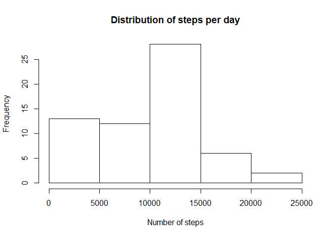
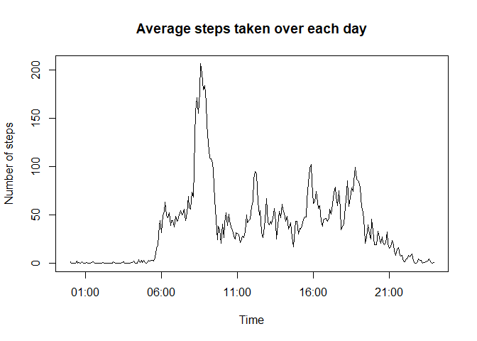
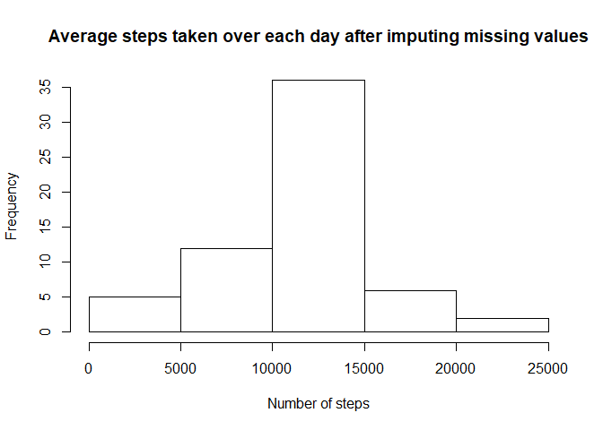
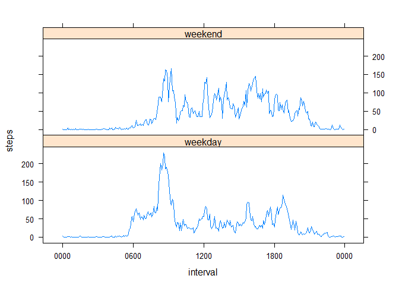

## Load and pre-process the data

Download the zip file, unzip it, and read the csv file into R.


```r
download.file("https://d396qusza40orc.cloudfront.net/repdata%2Fdata%2Factivity.zip", "activity_data.zip")
unzip("activity_data.zip")
activity <- read.csv("activity.csv")
```

Convert 'date' variable from class 'character' to class 'date'.
Pad 'interval' variable with zeros so it can be understood more easily as indicating the time. 


```r
library(stringr)
activity$date <- as.Date(activity$date)
activity$interval <- str_pad(activity$interval, 4, pad = "0")
```

## What is the mean total number of steps taken per day?

Use `tapply` to sum 'steps' by date, then plot histogram.


```r
step_day <- tapply(activity$steps, activity$date, sum, na.rm=TRUE)
hist(step_day, main = "Distribution of steps per day", xlab="Number of steps")
```

<!-- -->

```r
stepmean <- format(round(mean(step_day),0), big.mark=",")
stepmedian <- format(median(step_day), big.mark=",")
```

The mean number of steps per day is 9,354.
The median number of steps per day is 10,395.

## What is the average daily activity pattern?

Use `tapply` to average steps across days by 5-minute intervals. 
To plot as time series, I create a new matrix with the 'interval' variable converted to class POSIXlt.  


```r
step_time <- tapply(activity$steps, activity$interval, mean, na.rm = TRUE)
step_time_mat <- data.frame(time = strptime(names(step_time), "%H%M"), stepavg = step_time, row.names = NULL)
with(step_time_mat, plot(time, stepavg, type = "l", main = "Average steps taken over each day", xlab = "Time", ylab = "Number of steps"))
```

<!-- -->

```r
maxtime<- format(step_time_mat[step_time_mat$stepavg == max(step_time_mat$stepavg),'time'], "%H%M")
```

On average, the maximum number of steps was taken in the interval 0835.

## Impute missing values


```r
missing <- sum(is.na(activity$steps))
```

There are 2304 missing values in the dataset.

I fill in the missing values by using the mean for that 5-minute interval, calculated across all other days with non-missing values.

* I re-create the 'interval' variable of class 'character' in the step_time_mat data frame.
* 'interval' is used to merge 'step_time_mat' into the original 'activity' data frame, so that each observation has a corresponding step average for its 5-minute interval. 
* This step average is then written into the 'steps' variable for all observations with missing values. 


```r
step_time_mat$interval <- format(step_time_mat$time, "%H%M")
act_all <- merge(activity, step_time_mat, by = "interval")
act_all <- act_all[order(act_all$date, act_all$interval),]
act_all[is.na(act_all$steps),'steps'] <- act_all[is.na(act_all$steps),'stepavg']
```

Using the new dataset, I again use `tapply` to sum steps by date, and plot a histogram. 


```r
step_dayall <- tapply(act_all$steps, act_all$date, sum, na.rm=TRUE)
hist(step_dayall, main = "Average steps taken over each day after imputing missing values", xlab = "Number of steps")
```

<!-- -->

```r
stepmean_all <- format(round(mean(step_dayall),0), big.mark=",")
stepmedian_all <- format(round(median(step_dayall),0), big.mark=",")
```

The mean number of steps per day is 10,766.
The median number of steps per day is 10,766.

The mean and median steps are higher after imputing missing values.

## Are there differences in activity patterns between weekdays and weekends?

I create a new factor variable 'wday' to differentiate weekdays vs. weekends. 


```r
act_all$wday <- "weekday"
act_all$wday[weekdays(act_all$date) %in% c("Saturday", "Sunday")] <- "weekend"
act_all$wday <- as.factor(act_all$wday)
```

I sum the number of steps by 'interval', and create separate plots for weekday vs. weekend using lattice.


```r
library(lattice)
wday_time <- aggregate(steps ~ interval + wday, data = act_all, mean)
wday_time$interval <- as.POSIXct(strptime(wday_time$interval, "%H%M"))
xyplot(steps ~ interval | wday, data = wday_time, layout = c(1,2), 
       scales = list(x=list(format="%H%M")), type = "l")
```

<!-- -->
